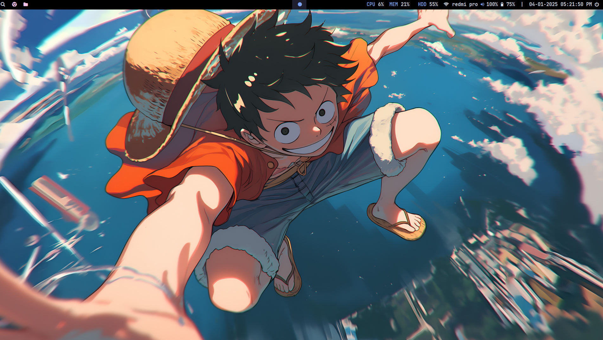
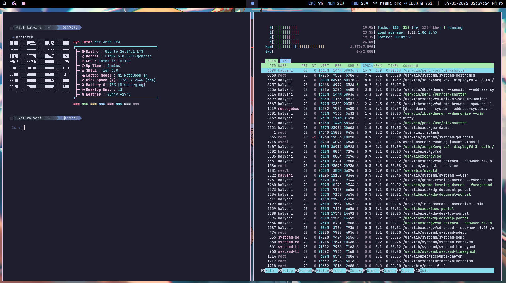
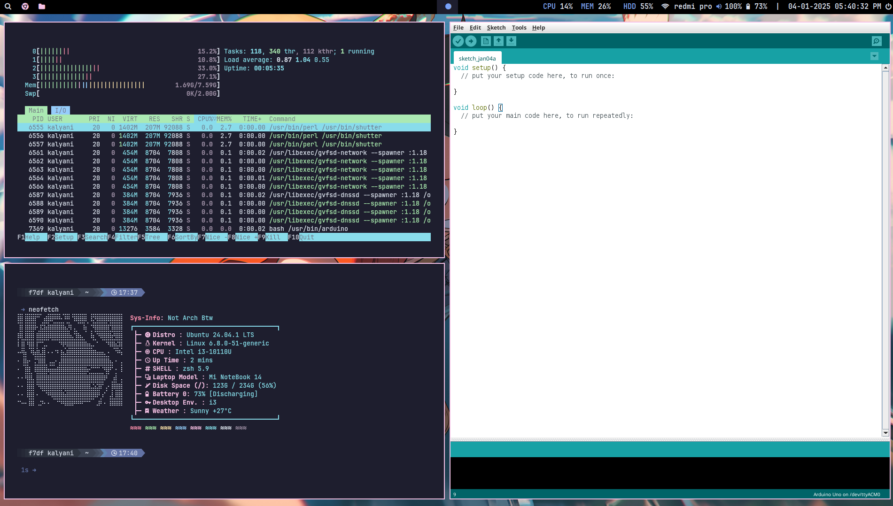

# Ubuntu i3-gaps Rice Configuration

A customized Ubuntu rice using i3-gaps window manager, featuring anime-styled Neofetch and various quality-of-life improvements. This configuration is adapted from Algorithm79's i3 dotfiles and modified for Ubuntu compatibility.

## Screenshots






## Features

- i3-gaps window manager with modern aesthetics
- Custom Polybar configuration
- Anime-styled Neofetch with random ASCII art
- Rofi launchers and window switcher
- Catppuccin color scheme throughout
- Autotiling support
- Clean notification system with Dunst
- Custom terminal setup with Kitty and Starship prompt

## Dependencies

### Essential Packages
```bash
sudo apt install i3-gaps polybar kitty rofi dunst papirus-icon-theme picom feh neofetch
```

### Additional Requirements
- [Nerd Fonts](https://www.nerdfonts.com/) (FontAwesome Icons + Hack Nerd Font)
- [Betterlockscreen](https://github.com/betterlockscreen/betterlockscreen)
- [Autotiling](https://github.com/nwg-piotr/autotiling)
- [Starship](https://starship.rs/)
- [Catppuccin Theme](https://github.com/catppuccin/catppuccin)

## Installation

1. Clone this repository:
```bash
git clone https://github.com/yourusername/ubuntu-i3-rice.git
cd ubuntu-i3-rice
```

2. Install required fonts:
```bash
# Download and install Hack Nerd Font
mkdir -p ~/.local/share/fonts
cd ~/.local/share/fonts
wget https://github.com/ryanoasis/nerd-fonts/releases/download/v3.0.2/Hack.zip
unzip Hack.zip
fc-cache -fv
```

3. Copy configuration files:
```bash
cp -r config/* ~/.config/
```

4. Set up wallpaper:
```bash
# Create wallpaper directory
mkdir -p ~/Pictures/Wallpapers
# Copy your wallpapers to this directory
# Edit ~/.config/i3/scripts/wallpaper.sh to point to your wallpaper directory
```

## Configuration

### Polybar
- Customize modules in `~/.config/polybar/config.ini`
- Edit colors in `~/.config/polybar/colors.ini`
- More configurations available in the [Polybar Wiki](https://github.com/polybar/polybar/wiki)

### Neofetch
- Custom anime ASCII art configuration in `~/.config/neofetch/config.conf`
- Reference the [Neofetch Wiki](https://github.com/dylanaraps/neofetch/wiki) for additional customization

### Rofi
- Launchers located in `~/.config/rofi/`
- Modify themes in `~/.config/rofi/themes/`
- Update keybindings in i3 config to match your preferred launchers

### Keyboard Shortcuts
- Open terminal (Kitty): `Mod + Enter`
- Launch Rofi: `Mod + d`
- Close window: `Mod + q`
- Lock screen: `Mod + x`
- Full keybinding list available in `~/.config/i3/config`

## Notes
- This rice is specifically modified for Ubuntu systems
- Some features might require additional configuration based on your hardware
- The Neofetch configuration includes a randomized anime ASCII art feature

## Credits
- Original dotfiles and inspiration from [Algorithm79's Dotfiles](https://github.com/Algorithm79/Dotfiles_i3)
- [Polybar Wiki](https://github.com/polybar/polybar/wiki)
- [Neofetch Wiki](https://github.com/dylanaraps/neofetch/wiki)
- Catppuccin Theme Community
